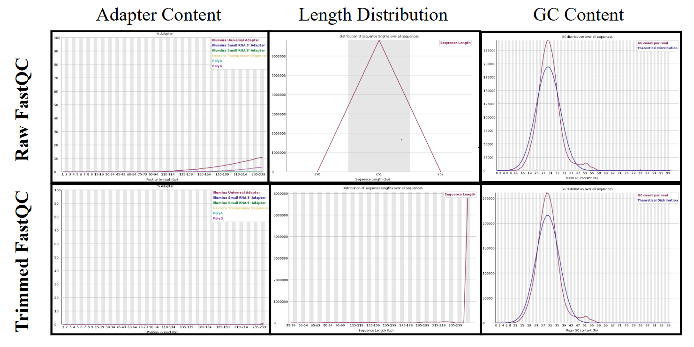
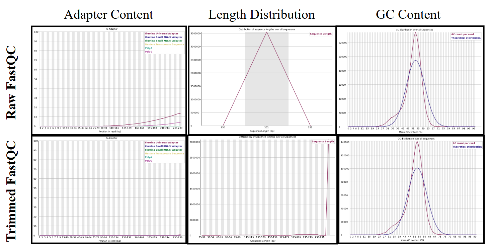
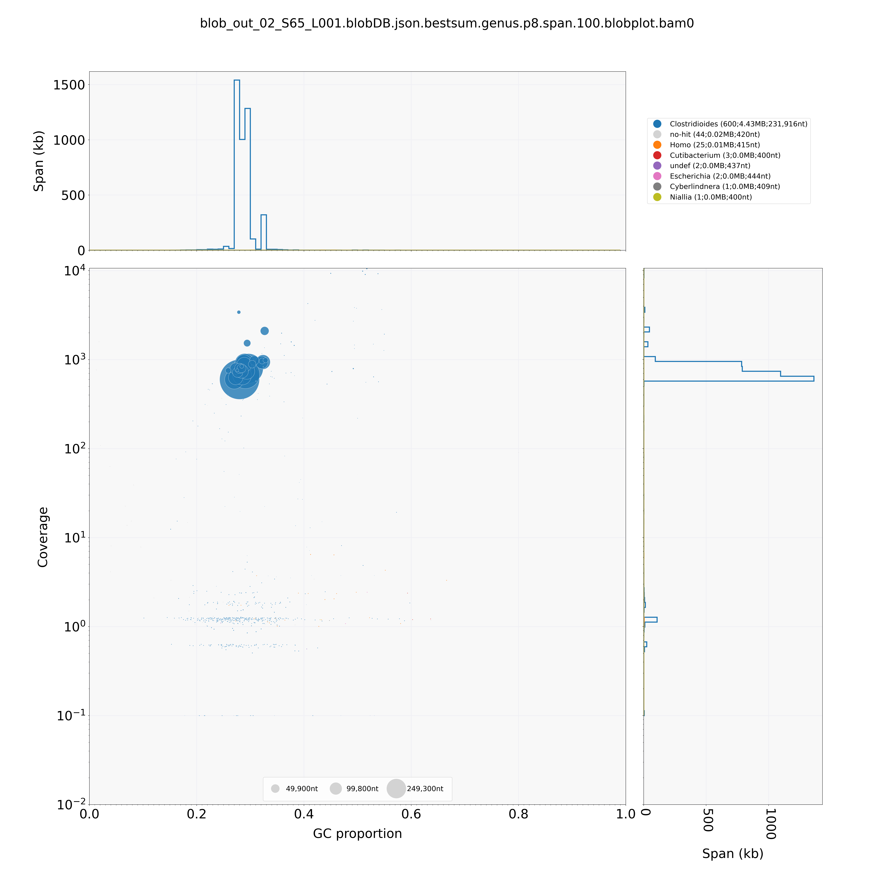
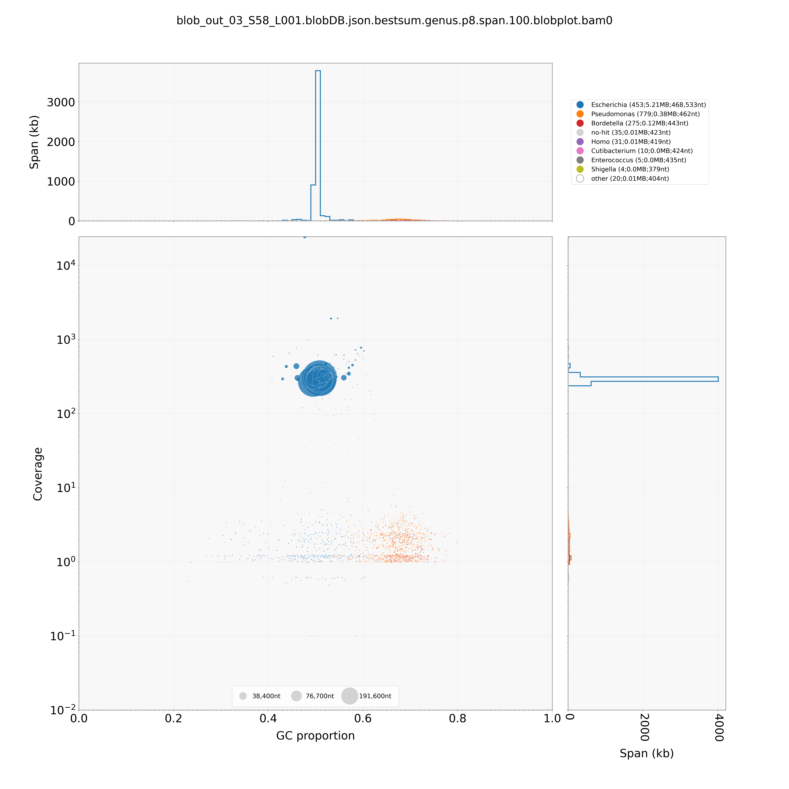

# GEN811_Final_Project: Bacterial Genome Assembly
### By: Emily Persson
## Background
The data used in this project are forward and reverse sequences (FASTQ files) from two different unidentified bacterial organisms. The project aims to identify these two organisms by assembling their genomes from the forward and reverse sequences.
## Code
Two scripts are run to assemble the bacterial genome(s) of one or more bacterial samples. The first is called 'bacteria_genome_assembly.sh' and performs the steps described in the 'Methods' section until the genome visualization step with BlobTools. This script takes a directory full of sequence FASTQ files (forward and reverse sequences) intended to be assembled as an argument. The second script, 'bacteria_genome_assembly_2.sh', calls BlobTools and finishes the genome assembly by filtering it.
## Methods
The sequences from the two unidentified bacterial samples were sequenced using Illumina sequencing. The University of New Hampshire's teaching server, RON, and multiple bioinformatics tools were used to assemble the genomes of the mystery bacterial samples.
### Tools
#### FastQC
The purpose of using FastQC in this project was to take a look at the read quality of the sequences. The input for FastQC is a sequence FASTQ file. FastQC outputs an HTML and a zip file for each given sequence. There are multiple read quality components in a FastQC HTML file. These components include basic statistics, per-base sequence quality, per-sequence GC content, per-base N content, sequence length distribution, sequence duplication levels, and adapter content, to name a few. The HTML file is then downloaded from RON to examine the FastQC findings. FastQC was performed on the forward and reverse reads from both mystery samples.
#### Trimmomatic
Trimmomatic is a tool that removes low-quality reads and adapter content from the sequence. A wrapper script for Trimmomatic was used in this project. The script takes two arguments: the forward read and the reverse read. The output is a directory called 'trimmed-reads' containing trimmed forward, reverse, unpaired forward, and unpaired reverse gzipped reads. FastQC is then performed on the trimmed reads to compare the quality results to the raw reads.
#### SPAdes
SPAdes is a genome assembly tool that is great with most bacterial genomes. SPAdes takes four input files: the trimmed forward, reverse, unpaired forward, and unpaired reverse reads. The output is a uniquely named directory (ex: 'spade_assembly_default_02_S65_L001) containing several files. The only files important for this assembly are the 'contigs.fasta' and 'spades.log' files. All files except those two were removed from the output SPAdes directory.
#### QUAST
Quast is used to assess the assembly created by SPAdes. It assesses the assembly by taking a look at the quality of the assembly. QUAST only takes one argument, which is the 'contigs.fasta' file produced by SPAdes. The output of this tool is another directory containing several files. Most of the output files contain the same information about the assembly quality, just in a different format. Output formats include TXT, PDF, TSV, HTML, and more.
#### BUSCO
BUSCO is used to determine how complete the assembled genome is. BUSCO takes the same input as QUAST, which is the 'contigs.fasta' output file of SPAdes. The output is also similar to QUAST, where there is an output directory containing several files. The two main output files are the 'short_summary_busco_output.txt' and the 'full_table_busco_output.tsv'. 
#### PROKKA
PROKKA is a tool used to annotate genomes. The input is the same as QUAST and BUSCO. The output is also similar, where there is an output directory containing various annotation files. These files include a GFF file for gene annotations and the FFN and FAA FASTA files used to create the GFF file. Using the output GFF file, a count for each gene annotation was also created and named 'protein_abundances_(Sample_Name).txt'.
#### 'extract_sequence'
This tool extracts sequences from a PROKKA FFN file based on a specified sequence header. The input is a string representing the sequence header to search for and a PROKKA FFN file to search in. This tool was used to extract the '16S ribosomal RNA' sequences from the output PROKKA FFN file.
#### BLAST
BLAST is an alignment tool that aligns a sequence to a reference sequence. BLAST was used multiple times in this project: BLAST the extracted 16S sequences against a custom database created from the 'contigs.fasta' file, BLAST the whole assembly ('contigs.fasta') against the nucleotide database, and BLAST the filtered assembly against the UniVec database. To create the 'contigs.fasta' database, the input is the 'contigs.fasta' file, and what database type being created. For this project, a nucleotide database was created, so the input was 'nucl'. The output is multiple 'contigs_db' files. To run blastn on the 16S sequence FASTA file, the input is the FASTA file and the created database, and the output is a TSV file with all the BLAST hits. BLAST is then used on the whole genome assembly to identify what organism the sequence belongs to. Later, the filtered genome is BLASTed against the UniVec database to check for contamination. The input for this is the filtered genome assembly FASTA, which then outputs a file 'genome_vs_univec_(Sample_Name).6' containing contamination hits.
##### blast-ncbi-nt.sh
A tool that will be used further down the pipeline is BlobTools. This tool requires a specific input BLAST file format. To make this easier, a special BLAST  script was used to BLAST the whole genome assembly against the nucleotide database (as mentioned in the main 'BLAST' section) and output a file in the     BlobTools-specific input format. This script takes one argument, the 'contigs.fasta' file, and outputs a file called 'contigs.fasta.vs.nt.cul5.1e5.megablast.out'. 
#### BWA mem
BWA mem is a read mapping tool that aligns the short sequences of the forward and reverse reads to a reference genome. The input includes the reference genome FASTA file, the forward read FASTQ, and the reverse read FASTQ. The reference genome for this project is the 'contigs.fasta' file, and the forward and reverse FASTQ files used were the trimmed versions. The output is a SAM file, which contains information on how and where the sequences map to the reference genome.
#### SAMtools
SAMtools is a tool used to convert a SAM file to a BAM file, where a BAM file is the binary version of a SAM file. The input for the conversion is the SAM file created by BWA mem, and the output is a BAM version of that file.
#### Bedtools
This tool is used to perform genomic arithmetic and analysis. It is used in this project to calculate the per-base coverage of the assembly. The input for this is the BAM file created by SAMtools, and the output is a file named 'coverage_(Sample_Name).out'.
#### 'gen_input_table.py'
This Python script is used to calculate per-contig coverage. The input for this script is the 'contigs.fasta' file and the 'coverage_(Sample_Name).out' file created by Bedtools. The output is a file named 'coverage_table_(Sample_Name).tsv'. This file consists of two columns: the contig header and the average coverage.
#### BlobTools
Blobtools is a genome assembly visualization tool that provides insights into what information should be filtered out of the assembly. The input consists of the 'contigs.fasta' file, the BAM file, and the output file 'contigs.fasta.vs.nt.cul5.1e5.megablast.out' from BLAST. The output is a JSON file that is then used to create a taxonomy table and a plot. These outputs are then used to filter the genome assembly.
#### filter_contigs_by_list.py
This Python script is designed to filter the assembly based on a list of contigs chosen to remain in the assembly. The input is the 'contigs.fasta' file, the TXT file of the list of contigs being kept, and a desired output name for a FASTA file. The output is the filtered genome assembly.
## Results

#### Figure 1
This figure shows three of the FastqC output plots for the 02_S65_L001_R1_001 sample. Both the FastQC results for the raw sequence and trimmed sequence are included. The FastQC for the raw sequence takes a FASTQ file of the raw sequence as its input, and the FastQC for the trimmed sequence takes a FASTQ file of the trimmed sequence as its input. For the adapter content plot, the adapter content present in the raw sequence is eliminated in the trimmed plot. The GC content for the sample is shown to be higher than the normal sequence GC content distribution. Overall, there is no meaningful change in the trimmed sequence. For the sequence length distribution plot, the raw sequence shows a better distribution than the trimmed sequence. The results for the reverse sequence, both raw and trimmed, are consistent with these.

#### Figure 2
This figure shows three of the FastQC output plots for the 03_S58_L001_R1_001 sample. Like Figure 1, the plots shown are adapter content, sequence length distribution, and GC content for both the raw sequence and the trimmed sequence. The findings of these three plots are also very similar to sample 02_S65_L001. The only difference is that the highest sequence length and GC content are lower than the 02_S65_L001_R1_001 sample.

#### Figure 3
A blobtools plot depicting the greatest taxonomic hits for the unidentified sample 02_S65_L001. As seen by the centralized blue dot, the taxonomy with the highest hit is Clostridioides. The smaller blue dots further down the plot represent contigs that we want to filter out. This plot was created using Blobtools with the output JSON mentioned in the methods section for Blobtools.

#### Figure 4
Another blobtools plot showing the greatest taxonomic hits for the other unidentified sample, 03_S58_L001. The taxonomy of this sample is Escherichia. The smaller colorful dots further down the plot represent other taxonomic hits that we want to remove by filtering the genome.
## References
1. Andrews, S. FastQC. Babraham Bioinformatics. https://www.bioinformatics.babraham.ac.uk/projects/fastqc/
2. BLAST Command Line Applications User Manual. (2008). National Center for Biotechnology Information (US). https://www.ncbi.nlm.nih.gov/books/NBK279690
3. Bolger, A.M., Lose, M., & Usadel, B. (2014). Trimmomatic: A flexible trimmer for Illumina Sequence Data. Bioinformatics. https://doi.org/10.1093/bioinformatics/btu170
4. Laetsch, D.R. & Blaxter, M.L. (2017). BlobTools: Interrogation of genome assemblies. F1000 Research. https://f1000research.com/articles/6-1287/v1
5. Laetsch, D.R., Koutsovoulos, G., Booth, T., Stajich, J., & Kumar, S. (2017). DRL/blobtools: BlobTools v1.0.1. Zenodo. https://zenodo.org/records/845347
6. Li, H. (2012). Exploring single-sample SNP and INDEL calling with whole-genome de novo assembly. Bioinformatics, 28, 1838-1844.
7. Li, H., Handsaker, B., Wysoker, A., Fennell, T., Ruan, J., Homer, N., Marth, G., Abecasis, G., Durbin, R., & 1000 Genome Project Data Processing Subgroup. (2009). The Sequence alignment/map (SAM) format and SAMtools. Bioinformatics, 25(6). https://doi.org/10.1093/bioinformatics/btp352
8. Manni, Mose, Berkeley, M.R., Seppey, M., Simao, F.A., & Zdobnov, E.M. (2021). BUSCO Update: Novel and Streamlines Workflows along with Broader and Deeper Phylogenetic Coverage for Scoring of Eukaryotic, Prokaryotic, and Viral Genomes. Molecular Biology and Evolution, 38(10), 4647-4654. https://doi.org/10.1093/molbev/msab199
9. Mikheenko, A., Saveliev, V., Hirsch, P., & Gurevich, A. (2023). WebQUAST: online evaluation of genome assemblies. Nucleic Acids Research. https://doi.org/10.1093/nar/gkad406
10. Pollard, T., Marshall, J., Balweirz, P., Young, G., Seifert, D., & Mollier, E. (2023). bedtools version 2.31.1. GitHub. https://github.com/arq5x/bedtools2/releases
11. Prjibelski, A., Antipov, D., Meleshko, D., Lapidus, A., & Korobeynikov. (2020). Using SPAdes De Novo Assembler. Current Protocols in Bioinformatics, 70(1). https://doi.org/10.1002/cpbi.102
12. Seemann, T. (2014). Prokka: rapid prokaryotic genome annotation. Bioinformatics, 30(14), 2068-2069. https://doi.org/10.1093/bioinformatics/btu153
13. Sevigny, J.L. (2018). MDIBL-T3-WGS-Tutorial. GitHub. https://github.com/Joseph7e/MDIBL-T3-WGS-Tutorial?tab=readme-ov-file
